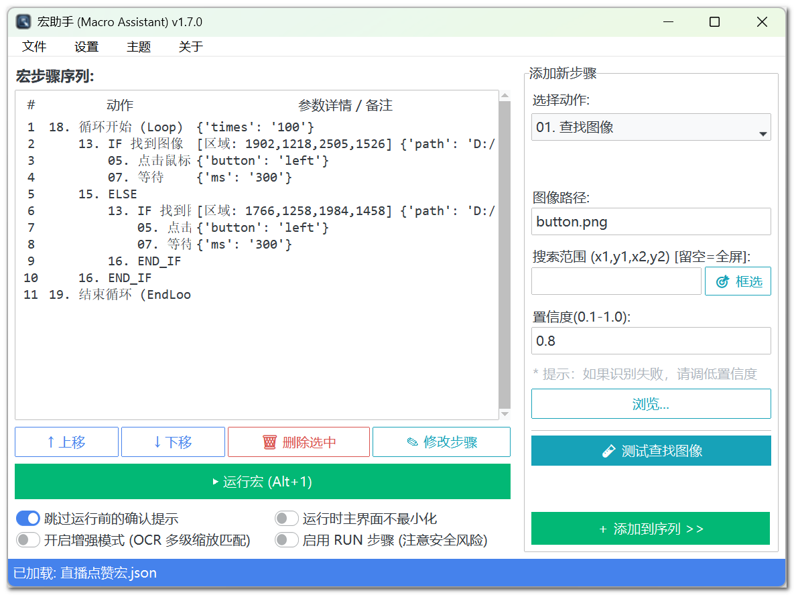

# MacroAssistant - 宏助手


## 📖 项目简介

**宏助手 (MacroAssistant)** 是一款开源免费的 Windows 桌面自动化工具，专为简化重复性任务而设计。无论是办公流程优化、桌面软件批处理、UI 测试，还是个人日常操作自动化，都可以通过图像识别、OCR 文字识别、键鼠模拟和流程控制，把原本需要反复手动点击、输入、判断的步骤整理成可复用的宏。

无需编程经验，通过直观的 GUI 界面即可创建自动化流程；需要更复杂逻辑时，也可以使用变量、文件读写、JSON 提取、条件跳转和逐行批量处理，把宏组合成更完整的数据流。

项目在响应速度、运行安全和多屏兼容上做了多轮优化，支持即时热键中断、悬浮状态栏、增强匹配模式、后台 OCR 预加载，以及负坐标/副屏场景下的截图识别。

<p align="center">
  
</p>

---

## ⚡ 核心功能与亮点

- **🛡️ 即时安全中断**：支持全局停止热键 `Ctrl+F11`、悬浮状态栏停止按钮、PyAutoGUI failsafe，以及 RUN 子进程清理。
- **🔍 图像与文字识别**：支持模板图像查找、OCR 文字定位、识别结果保存到剪贴板或变量，并可用正则表达式提取字段。
- **💼 多引擎 OCR**：集成 WinOCR、RapidOCR、Tesseract，可根据系统环境自动推荐或手动指定。
- **🚀 增强匹配模式**：图像查找可启用多级缩放匹配，OCR 可进行放大识别，提高低分辨率或复杂界面的命中率。
- **🧭 流程控制**：支持 IF/ELSE、普通循环、直到找到图像/文本、标签跳转、条件跳转，并带有最大跳转次数等安全阀。
- **🔗 变量与数据流**：支持设置变量、读取文件、正则提取、JSON 提取、变量计算、人工输入，并通过 `{变量名}` 在后续步骤复用。
- **📦 批量处理**：可从文件或变量中逐行读取账号、编号、订单、表单数据，每行执行一次完整流程。
- **📁 RUN 安全执行**：外部命令、脚本和文件写入默认受开关控制，需在主界面明确启用后才执行。
- **🖥️ 多屏支持**：截图、区域选择、OCR/VLM 坐标映射支持虚拟屏幕、负坐标和上下排列副屏。
- **🧪 调试友好**：步骤可屏蔽/启用，查找图像、查找文本和 AI 定位可在添加步骤前即时测试。

---

## 🚀 快速上手

1. 安装依赖：

```powershell
pip install -r requirements.txt
```

2. 启动程序：

```powershell
python MacroAssistant.py
```

3. 添加步骤：

常见流程是“先找目标，再点击，再输入，再等待或判断”。例如：

```text
01. 查找文本 (OCR): 登录
05. 点击鼠标
08. 输入文本: {account}
09. 按下按键: tab
08. 输入文本: {password}
09. 按下按键: enter
```

4. 运行与停止：

- 默认启动热键：`Ctrl+F10`
- 默认停止热键：`Ctrl+F11`
- 鼠标移动到屏幕角落可触发 PyAutoGUI failsafe 急停

---

## 📚 动作列表

| 序号 | 动作 | 说明 |
|---:|---|---|
| 01 | 查找图像 | 在全屏或指定区域查找图片模板，找到后移动鼠标到目标中心。 |
| 02 | 查找文本 (OCR) | 在屏幕或区域内查找文字，可保存识别结果到剪贴板或变量。 |
| 03 | 相对移动 | 基于当前鼠标位置移动指定偏移量。 |
| 04 | 移动到 | 移动鼠标到指定绝对坐标。 |
| 05 | 点击鼠标 | 执行左键、右键或中键点击，支持多次点击。 |
| 06 | 滚动滚轮 | 在当前位置或指定坐标滚动鼠标滚轮。 |
| 07 | 等待 | 暂停指定毫秒数，等待页面、程序或动画完成。 |
| 08 | 输入文本 | 输入固定文本或变量内容，支持 `{变量名}` 占位符。 |
| 09 | 按下按键 | 模拟单键或组合键，例如 `enter`、`ctrl+c`、`ctrl+v`。 |
| 10 | AI 自然语言命令 | 使用 VLM 分析截图，根据自然语言描述定位目标。 |
| 11 | 激活窗口 | 按窗口标题查找并激活目标窗口。失败默认中断，可配置忽略失败。 |
| 12 | 备注 | 添加说明。备注以 `LABEL:` 或 `标签:` 开头时，可作为跳转标签。 |
| 13 | 跳转到标签 | 跳转到指定备注标签，适合重试、分支汇合、状态流转。 |
| 14 | IF 找到图像 | 找到图片时执行 IF 块，否则跳过到 ELSE 或 END_IF。 |
| 15 | IF 找到文本 | 找到文字时执行 IF 块，否则跳过到 ELSE 或 END_IF。 |
| 16 | ELSE | IF 条件不成立时执行的分支。 |
| 17 | END_IF | IF/ELSE 逻辑块结束标记。 |
| 18 | 执行命令/脚本/文件 | 在授权后执行外部命令、脚本或文件操作。 |
| 19 | 循环开始 | 固定次数循环，或直到找到图片/文字为止。 |
| 20 | 结束循环 | 普通循环结束标记。 |
| 21 | 设置变量 | 创建或修改变量，例如把 `hello` 保存为 `{msg}`。 |
| 22 | 正则提取变量 | 从文本中按正则提取需要的字段并保存到变量。 |
| 23 | 读取文件到变量 | 把文本文件内容读取到变量中。 |
| 24 | IF 变量比较 | 比较变量或文本，支持数值比较、包含、不包含。 |
| 25 | 变量计算 | 对变量做加减乘除等安全计算，把结果保存为新变量。 |
| 26 | 条件跳转 | 条件成立时直接跳转到标签。 |
| 27 | 写入文件 | 把文本或变量写入文件，支持覆盖和追加。 |
| 28 | JSON 提取 | 从 JSON 文本中按路径提取字段。 |
| 29 | 人工输入 | 宏执行到此处暂停，询问用户输入内容并保存到变量。 |
| 30 | 批量处理每一行 | 从文件或变量中逐行读取数据，每行执行一次后续步骤。 |
| 31 | 结束批量处理 | 批量处理块结束标记。 |

---

## 💡 重点功能说明

本节只展开说明容易用错、需要组合使用、或存在安全边界的功能。点击、等待、移动、输入、按键等普通步骤已经在动作列表中说明，不再单独展开，避免 README 变成过厚的操作手册。

### 1. 变量系统

变量是高级流程的基础。宏运行时可以把识别到的文本、文件内容、计算结果、用户输入、JSON 字段等保存起来，后续步骤用 `{变量名}` 调用。

示例：

```text
21. 设置变量
变量名: account
变量值: test_user

08. 输入文本
文本: 当前账号是 {account}
```

运行时会输入：

```text
当前账号是 test_user
```

变量常见来源：

- `查找文本 (OCR)` 保存识别结果
- `设置变量`
- `读取文件到变量`
- `正则提取变量`
- `JSON 提取`
- `人工输入`
- `变量计算`
- `批量处理每一行`

变量常见消费位置：

- `输入文本`
- `IF 变量比较`
- `条件跳转`
- `写入文件`
- `执行命令/脚本/文件`
- `JSON 提取路径或源文本`
- `批量处理的数据内容`

### 2. 跳转到标签

跳转功能通过“备注”步骤定义标签。

先添加备注：

```text
12. 备注
内容: LABEL: 重试登录
```

然后添加跳转：

```text
13. 跳转到标签
目标标签名: 重试登录
最大跳转次数: 100
```

注意：

- 标签名必须唯一。
- 找不到标签会停止宏并提示错误。
- 重复标签会在运行前报错。
- 当前版本不支持跳转到循环内部标签。
- 当前版本不允许在普通 LOOP 或批量处理块内部执行 GOTO，避免流程失控。

### 3. 条件跳转

`条件跳转` 相当于“一行版 IF + GOTO”。当条件成立时，直接跳到目标标签。

示例：

```text
26. 条件跳转
比较左侧: {stock}
操作符: ==
比较右侧: 0
跳转标签: 缺货处理
```

适合减少很长的 IF 嵌套，例如缺货、失败、超时、不同等级处理等。

### 4. IF 变量比较

`IF 变量比较` 用于基于变量做分支判断。

支持：

- `==`
- `!=`
- `>`
- `<`
- `>=`
- `<=`
- `包含`
- `不包含`

数值比较会优先使用精确整数或 Decimal，避免大订单号、大流水号被 float 转换后丢失精度。

示例：

```text
24. IF 变量比较
比较左侧: {price}
操作符: >
比较右侧: 100
```

### 5. 变量计算

`变量计算` 用于对已识别或读取到的变量做简单运算，不建议当作普通计算器使用。

适合场景：

- OCR 识别价格后加运费
- 批量处理时生成序号
- 数量乘单价得到总价
- 判断前先计算折扣价

示例：

```text
25. 变量计算
表达式: ({price} + {shipping}) * 0.8
保存至变量: final_price
```

安全说明：

- 不使用 `eval()`。
- 只允许数字和基础运算符。
- 支持 `+`、`-`、`*`、`/`、`//`、`%` 和括号。
- 不支持调用函数、访问文件、执行系统命令。

### 6. 人工输入

`人工输入` 不是识别其他软件或网页弹窗。它的作用是：宏执行到这里时，由宏助手自己弹出输入框，等待用户输入内容，再保存到变量。

适合场景：

- 需要用户输入验证码
- 需要中途确认临时价格
- 需要人工补充一个无法自动识别的信息
- 半自动流程中保留人工决策点

示例：

```text
29. 人工输入
询问内容: 请输入验证码
保存至变量: code

08. 输入文本
文本: {code}
```

如果用户取消输入，宏会安全停止。

### 7. JSON 提取

`JSON 提取` 用于从 JSON 文本中取出指定字段。

示例 JSON：

```json
{
  "data": {
    "list": [
      { "price": 123.45, "name": "tea" }
    ]
  }
}
```

提取价格：

```text
28. JSON 提取
JSON 文本: {api_response}
提取路径: data.list[0].price
保存至变量: price
```

支持路径示例：

```text
data.list[0].price
$.data.name
items[0]['title']
```

如果路径不存在，可以配置失败默认值。

### 8. 批量处理每一行

`批量处理每一行` 用于处理批量数据。它可以从文件或变量中读取多行内容，每次取一行执行后续步骤，直到所有行处理完成。

典型数据文件：

```text
user001,pass001
user002,pass002
user003,pass003
```

批量处理配置：

```text
30. 批量处理每一行
数据文件: D:\accounts.txt
当前行变量: current_line
分隔符: ,
字段变量: account,password
```

每一轮会自动生成：

```text
{current_line}  当前完整行
{loop_index}    当前第几行，从 1 开始
{loop_total}    总行数
{account}       按逗号拆出的第 1 列
{password}      按逗号拆出的第 2 列
```

后续步骤可以直接使用：

```text
08. 输入文本: {account}
09. 按下按键: tab
08. 输入文本: {password}
09. 按下按键: enter
31. 结束批量处理
```

注意：

- 第一版不支持和普通 LOOP 互相嵌套。
- `FOREACH_LINE` 必须用 `END_FOREACH` 结束。
- `LOOP_START` 必须用 `END_LOOP` 结束。
- 错用结束标记会安全报错并停止，防止错误回跳。
- 默认跳过空行。
- 默认最大处理 10000 行，可在高级选项中调整。

---

## 🔎 OCR 与识别说明

支持的 OCR 引擎：

- WinOCR：Windows 10/11 内置，速度快。
- RapidOCR：识别能力强，依赖 ONNX Runtime。
- Tesseract：本地离线兜底方案。

OCR 识别结果可以：

- 保存到剪贴板
- 保存到变量
- 用正则提取其中一部分

示例：识别出 `总价 150.00 元`，正则填写：

```regex
\d+\.\d+
```

即可提取：

```text
150.00
```

---

## 🔐 RUN 步骤安全说明

`执行命令/脚本/文件` 能启动外部程序、运行脚本或写入文件，能力较强，因此默认需要用户主动启用。

建议：

- 只运行自己信任的命令和脚本。
- 长时间运行的外部进程支持停止时清理。
- 关闭 GUI 时会触发停止与进程清理，避免后台残留。
- 不需要外部脚本时，优先使用内置的 `读取文件到变量`、`写入文件`、`变量计算` 等步骤。

---

## 🖥️ 多屏与截图

当前版本已经对多屏、负坐标、副屏在上下方向等场景做了增强：

- 截图支持虚拟屏幕范围。
- 区域选择器支持跨屏坐标。
- OCR/VLM/核心截图逻辑统一处理主屏之外的坐标。

如果遇到锁屏、远程桌面断开、无显示器的虚拟机环境，截图可能不可用。宏会尽量安全报错或等待，而不是误判条件成功。

---

## 🧪 调试建议

推荐按以下顺序测试复杂宏：

1. 先单独测试 `查找图像` 或 `查找文本`。
2. 再添加点击、输入、等待。
3. 再加入 IF、GOTO、LOOP。
4. 最后加入变量、文件读写、批量处理。

批量处理建议先用 2 到 3 行测试数据验证，再换成完整文件。

开发回归测试命令（当前回归测试文件位于 `Beta` 目录）：

```powershell
python -m py_compile core_engine.py gui_utils.py MacroAssistant.py ocr_engine.py vlm_engine.py sys_utils.py
python -m unittest discover -s Beta -p "test*.py" -v
```

---

## ⚠️ 注意事项

- 自动化会真实控制鼠标和键盘，请先在安全环境测试。
- 启用 RUN 前确认命令来源可信。
- 图像识别对缩放、主题、分辨率敏感，必要时重新截图模板。
- OCR 对字体、背景、语言包和截图质量敏感，必要时限定搜索区域。
- GOTO 和循环都有安全限制，避免死循环。
- 批量处理请先小样本测试，确认字段拆分正确。

---

## 📄 许可

本项目基于 MIT License 开源。
